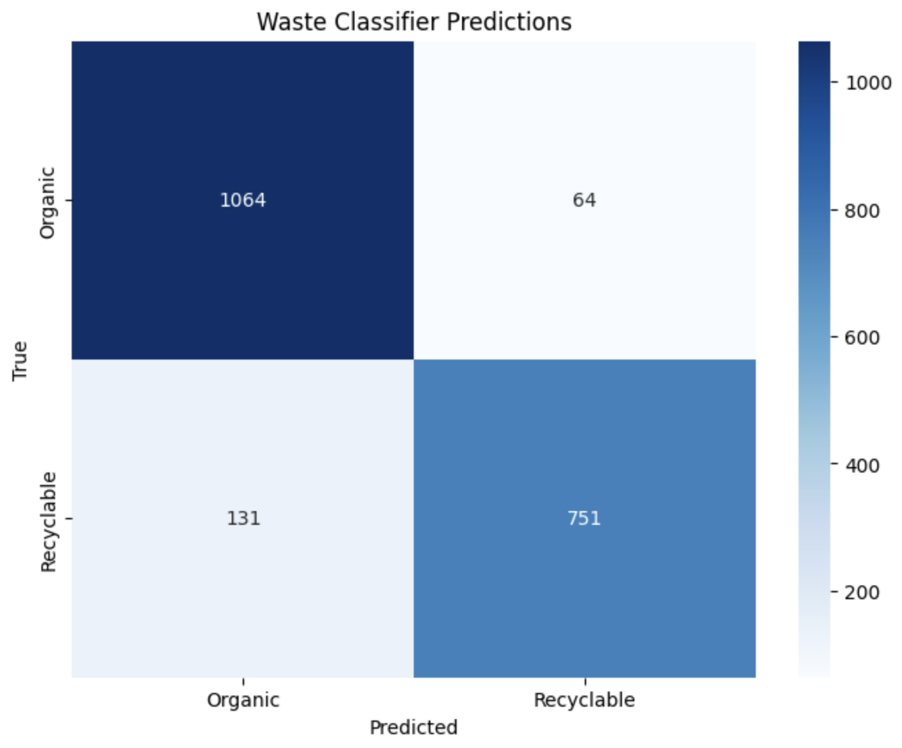

# Waste Classifier

A convolutional neural network that classifies waste based on whether it is recyclable or not.

## Table of Contents
- [About](#about)
- [Features](#features)
- [Screenshots](#screenshots)
- [Installation](#installation)
- [Usage](#usage)
- [Model Training](#model-training)
- [Contributing](#contributing)
- [License](#license)

## About

The Waste Classifier is a deep learning model built for the purpose of waste classification. It utilizes a custom convolutional neural network (CNN) to classify waste into two categories: organic and recyclable. This is a personal deep learning project using PyTorch that aims to contribute to waste management initiatives by automating the sorting process, impacting the environment for the better! :)

## Features

- Convolutional Neural Network for waste classification.
- Binary classification: Organic and Recyclable.
- Model training script for customization.
- Model testing script for predictions with a trained model

## Screenshots

An example of prediction results from a trained model with an average of 90% accuracy:


## Installation

To get started, follow these steps:

1. Clone the repository:

    ```bash
    git clone https://github.com/alvaroderas/waste-classifier.git
    ```

2. Install dependencies:

    ```bash
    pip install -r requirements.txt
    ```


## Model Training
1. Edit any constants to experiment with training.
2. Navigate to src directory and run the model training script:

    ```bash
    python train.py
    ```
## Usage

To use the Waste Classifier to visualize waste classification predictions with a trained model, navigate to test directory and run the script:

```bash
python predictions.py
```

## License
This project is licensed under the [MIT License](LICENSE).
